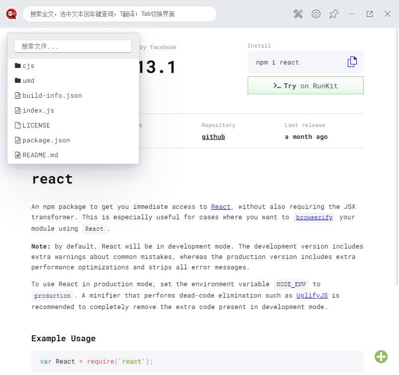

# npm 插件
快捷的查询 npm 库

使用了 vue + vant + typescript 进行项目开发

<!-- 按需加载组件 -->

# TODO
1. 页面缓存 -- 完成
2. 目录显示跟随 -- 完成
3. 启动页更改 -- 完成
4. 输入框提示 -- 完成
5. 搜索列表 上下按键选择  -- 完成
6. 详情页面搜索 -- 完成
7. 详情页面翻译 -- 完成
8. esc 键关闭打开，或者点击其他处关闭
9. package.json 文件分析
10. 是否可以考虑记录一下最近的5个查询，好方便回找

# 参考

移植了 : https://hub.fastgit.org/fofolee/uTools-Manuals/tree/master/src 的一些功能为 Vue 组件!
单词翻译部分：https://github.com/vst93/myDictionary-uToolsPlugin/

# Bug
翻译点号会出现问题~